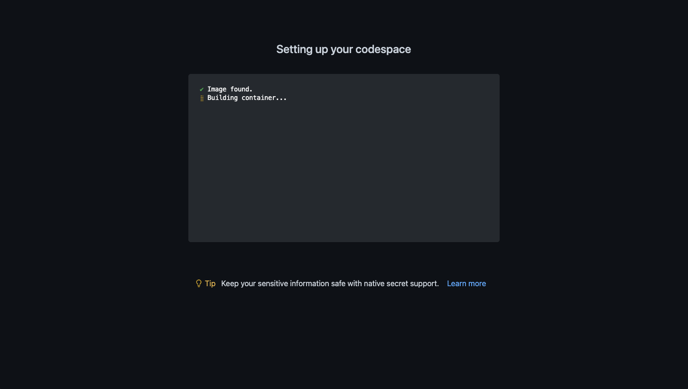
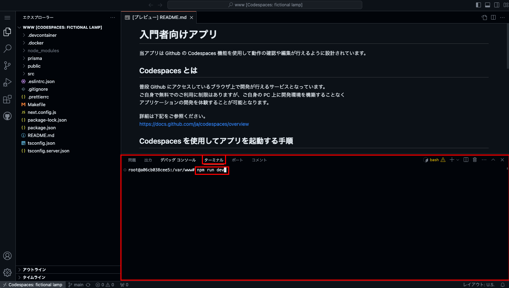
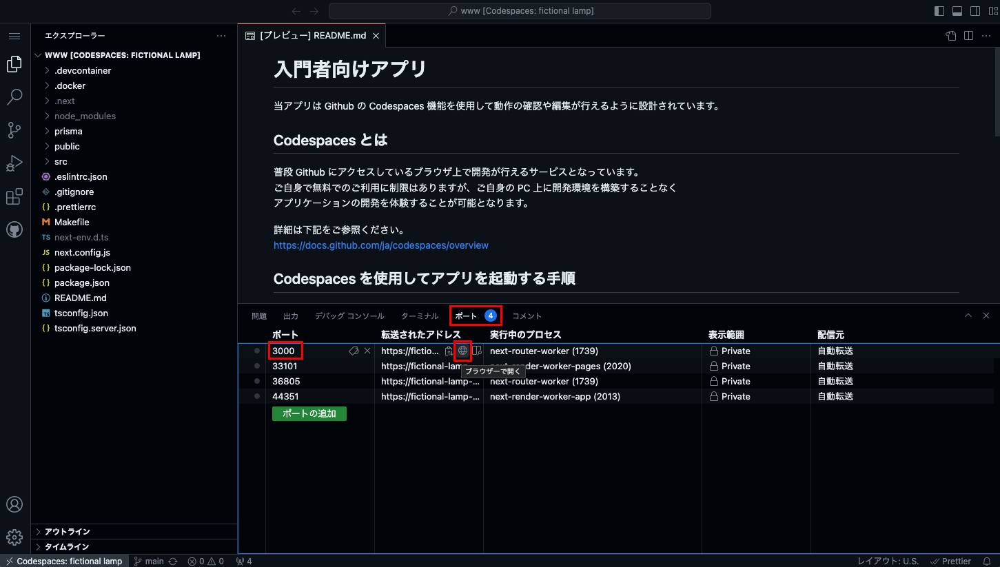

# 学習用教材: Next.js 簡易 SNS アプリを作成しよう！

今回の教材では簡易的な SNS アプリのような昨日を作成していきます！

データベースを利用したデータの保管やログイン処理などはないため、実際の SNS 機能とは程遠いですが、<br />
DUMMY のデータをや Next.js のステート機能を活用して、 SNS っぽい動作を作成していきます。

表示用 HTML コードの作成、CSS でのスタイリング設定、コンポーネントを作成した部品化、ステートを活用しての画面更新など<br />
簡易的なアプリになりますが、様々な実装をしていきます。<br />
多くのことを一度にやってしまうと混乱してしまいますので、以下手順に沿って一つ一つ実装を重ねていきましょう！

1. 投稿の一覧を表示するタイムラインページを作成しよう！<br />
   投稿ページのベースとなる HTML コードを記述し、 CSS で見た目を整えましょう。<br />
   コードをコンポーネントに分けることで重複する記述を避けてスッキリとしたコードを目指そう！

2. フレンドの一覧を表示するページを作成しよう！<br />
   1 と同じく HTML と CSS を記述してベースとなるページの作成をしよう！

3. 表示する投稿一覧やフレンド一覧をデータ取得処理を介して表示してみよう！<br />
   データベースとは異なりますが、表示する投稿データやアカウントデータを用意しているので、取得処理を書いてデータを取得しよう。<br />
   画面に取得したデータを表示するためには HTML の形式に変換することで、手動ではなくデータのルールに沿って画面に表示することができます。

4. 擬似的な投稿機能を作成してページの表示内容を更新してみよう！<br />
   ユーザーが投稿欄に入力した内容を使用して、データの更新をする処理を書いてみましょう。<br />
   今回はデータベースを使用していないのでページをリロードすると投稿した内容が消えてしまいますが、<br />
   どのようにして投稿データを抽出してデータを更新していくのかを体験しましょう！

上記の手順はそれぞれ `sample/〇〇` ブランチで参考となるコードを確認できます。
初めてのうちは混乱することもあるかもしれませんが、一つ一つの機能を整理してコードの内容を理解していきましょう！

## 動かし方

当アプリは Github の Codespaces 機能を使用して動作の確認や編集が行えるように設計されています。

### Codespaces とは

普段 Github にアクセスしているブラウザ上で開発が行えるサービスとなっています。  
ご自身で無料でのご利用に制限はありますが、ご自身の PC 上に開発環境を構築することなく  
アプリケーションの開発を体験することが可能となります。

詳細は下記をご参照ください。  
https://docs.github.com/ja/codespaces/overview

### Codespaces を使用してアプリを起動する手順

#### 1. 新規スペースを作成する

まずはじめに新規スペースを作成してエディタを立ち上げます。

以下画面を参考にし、当リポジトリの「Use this template」ボタンをクリックして「Open in a codespace」をクリックしてください。


※ 画像に表示されている画面は当リポジトリではありません

以下画面に切り替わり、開発環境が自動で構築されます。



※ 構築が完了するまで数分かかる場合があります。

#### 2. ターミナルでアプリの起動コマンドを実行する

1 でスペースの作成が完了すると、コードを編集するためのエディタが表示されます。

エディタ下部にあるターミナル画面に以下コマンドを入力してエンターキーで実行し、アプリケーションを起動してください。

```
npm run dev
```



#### 3. 起動したアプリをブラウザで確認する

2 でアプリの起動が完了すると、右下に以下のようなポップアップが表示されますので「ブラウザーで開く」をクリックしましょう。


上記が表示されない場合は以下の画像を参考にエディター下部の「ポート」タブから「3000」番のポートを探し、地球儀アイコンをクリックすることでも開くこともできます。



ブラウザで開いたら下記画面が表示されれば起動成功になります！


※ 画像に表示されている画面はアプリによって異なります
